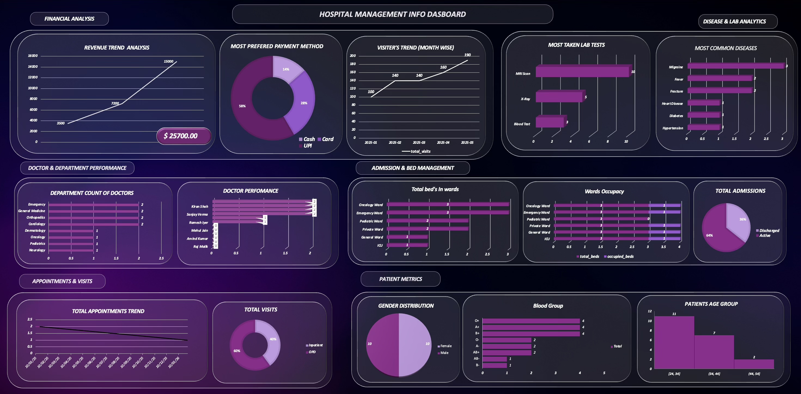

**Hospital Management System – SQL**

A comprehensive Hospital Information System focused on advanced MySQL database design, automation, and analytical reporting.
This project emphasizes relational modeling, normalization, stored procedures, triggers, and SQL views, with a minimal API-based application used to automate structured data entry into MySQL.

⸻

Project Overview

Designed a real-world Hospital Information System with the following highlights:
	•	Implemented 28 fully normalized MySQL tables for robust and scalable data management
	•	Enforced business logic at the database level using constraints, triggers, and stored procedures
	•	Created SQL views for streamlined analysis and reporting
	•	Built an Excel dashboard using exported SQL view data for visual insights
	•	Automated data insertion using REST APIs (JSON → MySQL) to eliminate manual SQL execution

⸻

Database Design
	•	Total Tables: 28
	•	Normalization Levels: 1NF, 2NF, 3NF

Key Modules
	•	Patients, Doctors, Departments
	•	Appointments, Admissions, Visits
	•	Wards, Beds
	•	Billing & Payments
	•	Prescriptions & Medicines
	•	Lab Tests & Results
	•	Staff, Shifts & Attendance

All tables are interconnected using primary keys and foreign keys, ensuring strong data integrity, consistency, and reliability.

⸻

ER Diagram

The ER diagram below illustrates the complete hospital database structure and relationships among all 28 tables.

⸻

SQL Features Implemented
	•	DDL: Table creation with constraints for data validation
	•	DML: Structured data insertion for efficient operations

Stored Procedures
	•	admit_patient
	•	discharge_patient
	•	book_appointment
	•	record_visit
	•	generate_bill
	•	make_payment
	•	order_lab_test
	•	create_prescription
	•	Triggers: Automated business rule enforcement
	•	Views: Pre-aggregated datasets tailored for analysis
	•	Transactions: Ensuring atomic and reliable operations

Note: All INSERT and UPDATE operations are handled exclusively through stored procedures to maintain controlled and secure data flow.

⸻

Data Analysis and Dashboard
	•	Created multiple SQL views for comprehensive reporting
	•	Exported view results to Excel for further processing
	•	Built an analytical dashboard covering:
	•	Admissions and visit trends
	•	Doctor workload analysis
	•	Ward and bed occupancy rates
	•	Billing and revenue insights
	•	Patient demographics

Dashboard Preview

⸻

API and Automation Layer

To streamline data entry and eliminate manual SQL execution:
	•	A frontend application collects hospital data via a structured user interface
	•	Data is transmitted as JSON via REST APIs
	•	Backend validation ensures data accuracy and consistency
	•	Backend executes MySQL stored procedures for secure database storage

This approach guarantees controlled, consistent data flow and improves overall system reliability.

⸻

Tools and Technologies
	•	MySQL – Core database engine
	•	SQL – DDL, DML, Views, Triggers, Stored Procedures
	•	Node.js and Express – API middleware
	•	React – Data entry user interface
	•	Excel – Dashboard and reporting
	•	GitHub – Version control and collaboration

⸻

Key Learnings
	•	Real-world relational database modeling and design
	•	Advanced SQL automation and integrity enforcement
	•	API-driven database interaction patterns
	•	Analytics-ready schema design
	•	Transforming SQL data into meaningful dashboards

⸻

Author

Mohamed Arshad M
Engineering Student | SQL and Database Systems Enthusiast

⸻

If you want, I can now:
	•	Optimize this for college submission format
	•	Create a viva explanation script
	•	Shorten this into a resume-ready project summary
	•	Add a system architecture diagram section